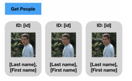

# UI Test

Made with `create-react-app` ejected with `sass-loader`.

## Requirements

Create a stand-alone HTML page to work with the latest Google Chrome browser
- Create a functional button (at this stage, using only HTML and CSS) given the following flat images:
  
- Change the font of the button to a Google Font of your choice
- Add mouse-over change of state / look with any CSS transition of 1 second length from the normal state to the hover state (and back)
- Add a custom transition function to your mouse-over transition (https://matthewlein.com/tools/ceaser may help)
- Make the button resize as its container changes in width (create a DIV around the button that has a percentage width)
- After clicking the button, initiate a GET request and fetch some (fake) data from here: https://reqres.in/api/users?page=1 (you can use jQuery)
- Below the button, display a list of people with first name, last name and their image (according to the data you fetched in the previous step) as a “card” for each person, displaying their individual id, last and first name as such:
  
- Implement paging by providing a left / right button to move to the previous / next page of people. The text field should be editable and reflect the current page, come up with a text field CSS that matches the style of the buttons:
  
- Handle edge cases (page < 1 and > # of pages) by hiding the right and left arrow button when appropriate
- Handle user input to the text field that are out of range / not a number by keeping the previous (valid) page # and displaying an alert.